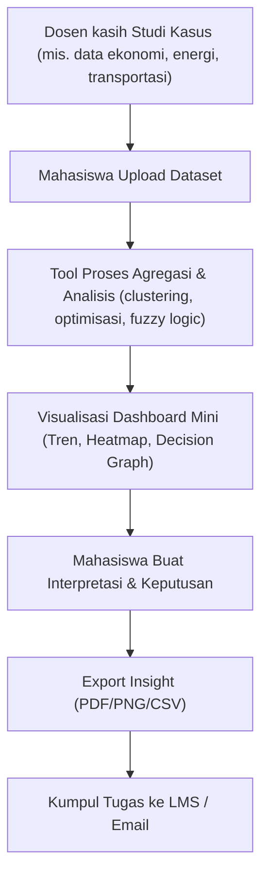

# RANTAI KomNumLab ⚙️

**Computational Numerics / Benchmark Lab — experiment scaling, runtime, memory, curve fitting (Big-O demonstration).**

---

## What is KomNumLab?
RANTAI KomNumLab is designed for experiments about *performance and scaling* of numerical algorithms. Students/specs submit experiment descriptors (JSON) that describe algorithms, input generators, sizes, and repetitions. The system runs benchmarks and returns metrics + fitted complexity curves.

---

## Goals
- Teach computational complexity from empirical experiments.
- Provide interactive visualizations (log-log plots, fitted exponent).
- Provide reproducible experiment runs and shareable reports.

---

## Example experiment JSON
```json
{
  "experiment_name": "gauss_vs_lu_dense",
  "algorithms": ["gauss_elimination", "lu_decomposition"],
  "matrix_type": "dense",
  "sizes": [50,100,200,400,800],
  "repetitions": 5,
  "seed": 42
}
```

---

## Output (summary)
```json
{
  "experiment_id": "exp-001",
  "metrics": {
    "gauss_elimination": {
      "sizes": [50,100,200,400,800],
      "time_mean": [0.01,0.08,0.64,5.1,41.2]
    }
  },
  "fitting": {
    "gauss_elimination": {"p": 2.98, "coef": 1.2e-7}
  },
  "downloads": {
    "csv": "/api/komnum/experiments/exp-001/metrics.csv"
  }
}
```

---

## Flowchart


---

## Features

- Experiment definition via JSON

- Synthetic data generators (dense/sparse)

- Containerized bench workers (resource-limited)

- Collected metrics: time mean/std, memory peak, residuals

- Fitting of scaling law (log-log linear regression)

- Visualizations: log-log trend + fitted curve

- Instructor lab templates + auto-grading rubrics

---

## License
MIT © 2025 RANTAI / ELPEEF
